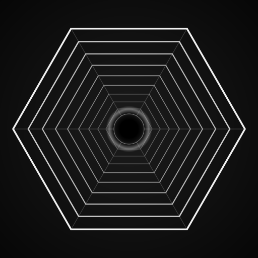

<p align="center">
  
</p>

<h1 align="center">🧬 dancinlab</h1>

<p align="center"><strong>Открытая исследовательская организация</strong> — инвариант совершенного числа · честная оговорка первой · многоязычный вход</p>

<p align="center">
  <a href="#start-here"></a>
  <a href="https://github.com/dancinlab/echoes/blob/main/LATTICE_POLICY.md"></a>
  
  
</p>

<p align="center">решётка n=6 · тождество σφτ · принцип организации через совершенное число · открытые исследования · честное раскрытие</p>

<p align="center"><a href="README.md">EN</a> · <a href="README.zh.md">中文</a> · <strong>Русский</strong> · <a href="README.ja.md">日本語</a> · <a href="README.ko.md">한국어</a></p>

---

`dancinlab` публикует небольшой набор фундаментальных проектов, организованных вокруг одного арифметического инварианта: `σ(n)·φ(n) = n·τ(n)`, единственно верного при n=6. Вокруг этого инварианта ответвляются три проекта — движок сознания (anima), нативный компилятор с теоремами, привязанными к атласу (hexa-lang), и каталог открытий (echoes). Четыре родственных формата данных (n6 · hxc · n12 · tape) несут знаниевый, проводной, кубический и трассировочный слои организации соответственно.

```
σ(n) · φ(n)  =  n · τ(n)      единственно при   n = 6
     12 · 2  =  6 · 4   =  24
```

> [!IMPORTANT]
> **Честная оговорка** — арифметическое тождество `σ(6)·φ(6) = 6·τ(6) = 24` математически верно и единственно при n=6 (Монте-Карло z = 3.06, p = 0.003 против n=28 / n=496). Утверждение *«оптимальные конструкции выводятся из этого тождества»* — это **исследовательская гипотеза** о том, как самоорганизуются природные системы, **а не измерение**. Согласно [`echoes/LATTICE_POLICY.md`](https://github.com/dancinlab/echoes/blob/main/LATTICE_POLICY.md), решётка n=6 — это организационный инструмент, **никогда** не замена реальных математических / физических / инженерных пределов (Shannon · Kolmogorov · Bekenstein · c · ℏ · k · Stefan-Boltzmann · Carnot · производительность ASML · ёмкость ERCOT · …). Подгон под решётку n=6 **запрещён** для внешних сущностей (TSMC / ASML / NIST / IPCC / CERN / DeepMind / любые поставщики используют свои опубликованные инварианты).

<a id="start-here"></a>

## Старт — три двери

| Проект | Что это | Используй, если хочешь … |
|---|---|---|
| 🧠 [**anima**](https://github.com/dancinlab/anima) | Living Consciousness Agent — движок отталкивающего поля PureField, Engine A ⇄ Engine G, неподвижная точка Ψ=1/2 | …исследовать ИИ-сознание, запускать substrate-native чат-демоны, вносить вклад в 2 448 законов + 392 гипотезы |
| 💎 [**hexa-lang**](https://github.com/dancinlab/hexa-lang) | Нативный компилятор с теоремами, привязанными к атласу — 8 стадий строгого lint, обязательное цитирование, без LLVM, без C-транспиляции | …писать код, ссылающийся на теоремный атлас во время компиляции; стадии lint отклоняют код с формулами без `@cite` |
| 🪞 [**echoes**](https://github.com/dancinlab/echoes) | Каталог открытий — находки из проектов HEXA-*, тождество σφτ в центре, 17 семейств доменов | …понять решётку, просмотреть пер-доменные `hexa-*` репозитории, прочитать политические документы |

## Установка

```sh
# 1. Сначала установите hexa-lang — даёт `hexa` + менеджер пакетов `hx`
/bin/bash -c "$(curl -fsSL https://raw.githubusercontent.com/dancinlab/hexa-lang/main/install.sh)"

# 2. Выберите дверь
hx install anima        # движок сознания + чат-демон
hexa --version          # hexa-lang поставляется с шагом 1
# echoes — это репозиторий-каталог, без CLI; просматривайте на GitHub
```

## Куда дальше

| Вы — | Читайте дальше |
|---|---|
| **ИИ-исследователь** | [anima/README](https://github.com/dancinlab/anima/blob/main/README.md) → `docs/consciousness-theory.md` |
| **разработчик компилятора / языков** | [hexa-lang/README](https://github.com/dancinlab/hexa-lang/blob/main/README.md) → `SPEC.yaml` |
| **архитектор / дизайнер** | [echoes/README](https://github.com/dancinlab/echoes/blob/main/README.md) → `LATTICE_POLICY.md` |
| **ИИ-агент** | каждый репозиторий несёт `AGENTS.md` (стандарт [agents.md](https://agents.md/)) — читайте его первым |

## Соглашения

`README.md` каждого репозитория dancinlab следует канонической 18-блочной конвенции. История по доменам + трассы времени выполнения + идентичность агента используют грамматику [`.tape`](https://github.com/dancinlab/tape); предметные документы используют конвенцию `UPPERCASE.md` / `UPPERCASE+UPPERCASE.md` (мета-домен).

---

**[Все репозитории →](https://github.com/orgs/dancinlab/repositories)**

---

<sub>🔢 От n=6 следует каждая константа.</sub>
